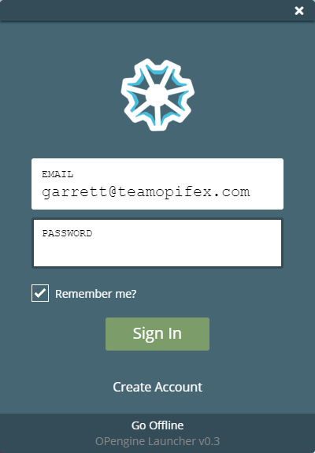
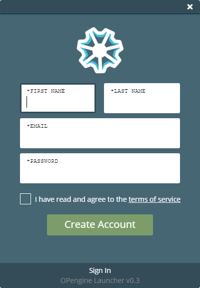

Create an Account
==================

When you first start the OPengine Launcher you'll be asked to sign in with an OPifex Entertainment Account. This is the same account used for any and all OPifex games that ask for a sign in. If you already have an OPifex account, you can use it to sign in, otherwise you'll need to create a new account.

When creating an account, your e-mail address will be used as your username. If you have trouble creating an account, need to change your e-mail address, or problems signing in please contact support@opengine.io
