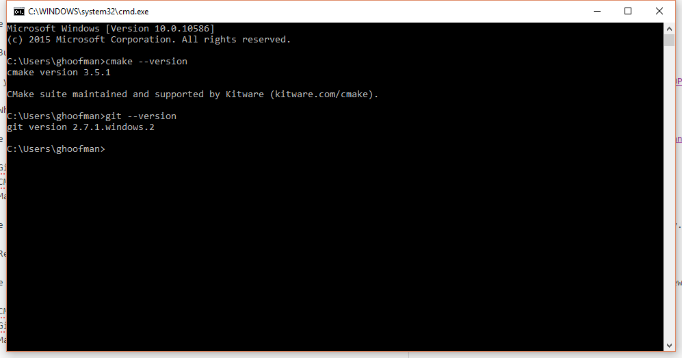
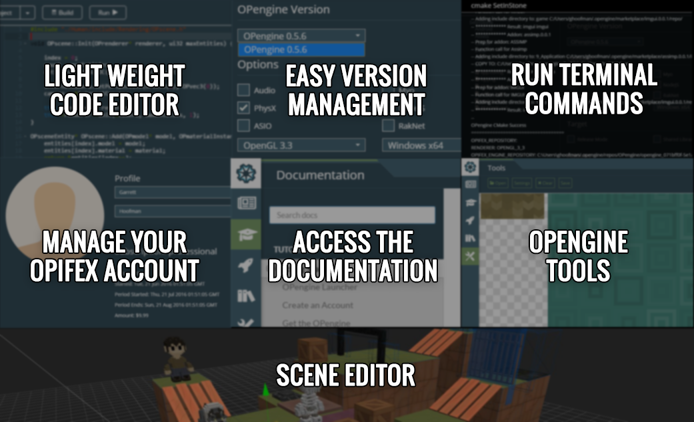

OPengine Launcher
================

The launcher is used to easily setup and run the OPengine.

.. image:: launcher.png

***************
How to get it
***************

**Download**

The latest OPengine launcher binaries can downloaded from: http://opengine.io/download

**Build It**

If you prefer to build it yourself, or if you want to modify it, the source code can be found here: https://github.com/TeamOPifex/OPengine.Launcher

**What is it?**

The OPengine Launcher is sort of like a dummy terminal made with `ElectronJS <http://electron.atom.io/>`_ and `AngularJS <https://angularjs.org/>`_. It runs all of the command-line methods behind the scenes for you like:

* Git - Pull, Init, etc
* CMake - Generate your project files
* Make - Build with MSVC or the make system

The OPengine can be completely built and run with out the OPengine Launcher, it's there primarily for convenience and ease of entry. Though it's highly recommended that you use it so that you don't miss anything.

*********************************************
Requirements for the OPengine Launcher
*********************************************

*"The Room of Requirement is located on Hogwarts' seventh floor, across from the tapestry of Barnabas the Barmy. To "open it" you must walk past the area of the door three times, thinking of what you need.""*

The OPengine Launcher itself is stand alone but in order for it to run the command line programs behind the scenes you'll need a few things installed.

* CMake - https://cmake.org/
* Git - https://git-scm.com/
* Make or MSVC - https://www.visualstudio.com

The launcher needs command line access to these programs, which it uses via your Environment PATH variable. If you can't access the program when opening up your command line, then neither can the OPengine Launcher.

*********************************************
Features
*********************************************

* Cross Platform (Windows, OS X, Linux)
* Light weight text editor with code highlighting
* Easy versioning system for the OPengine
* Easy project creation and management
* Scene Editor
* Helper Tools
* Easily turn on and off engine features and addons
* Manage your OPengine Licensing
* Access to the OPengine Docs
* Easy access to OPengine Tools ( ex: Font Maker, Mesh Builder, Sprite Generator )

